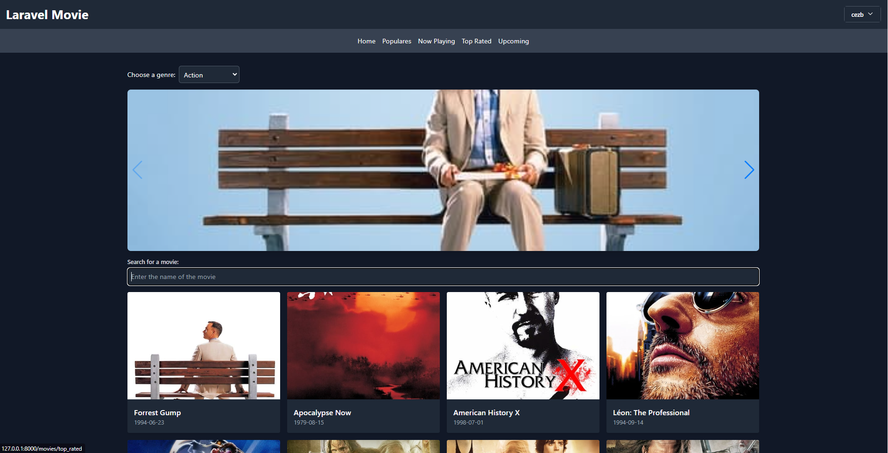
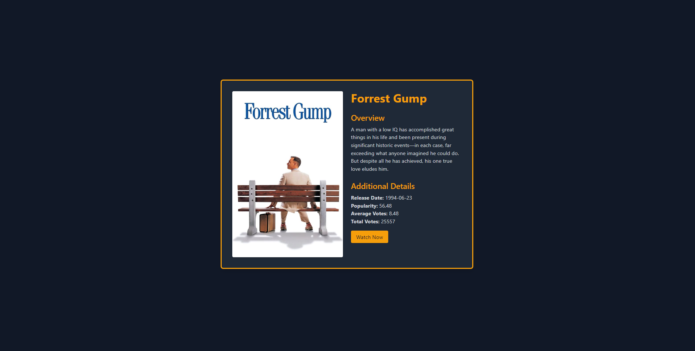
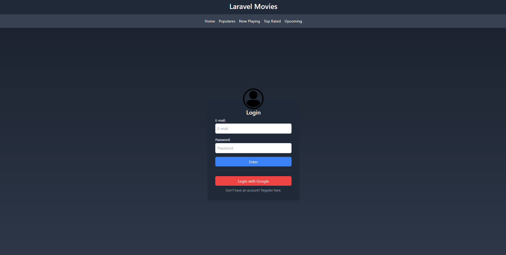
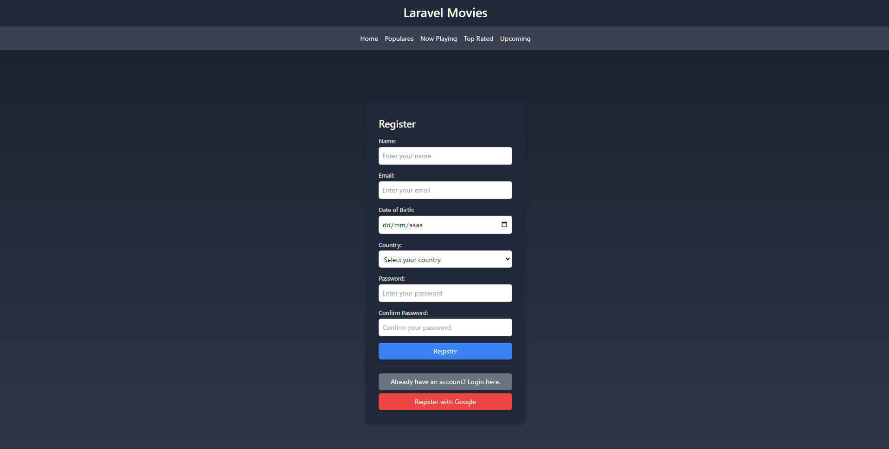

<h1 align="center">Laravel-Movies</h1>
This repository contains the source code of a web application developed in Laravel, a modern and powerful PHP framework. The application allows users to explore information about movies, including details, reviews, and posters. Additionally, it offers features such as user registration, login, password reset, and integration with Google for authentication.

# 🍿 Features 

## Movie Exploration

- Home Page: Displays a selection of featured movies.
- Genre Filtering: Allow users to filter movies by genre, such as action, comedy, drama, etc.
- Movie Search: Add search functionality to allow users to search movies by title.
- Popular Movies: displays a section for popular movies
- Upcoming movies: displays a section for upcoming movies
- Now Playing movies: displays a section for now playing movies
- Top Rated movies: displays a section for top rated movies

## Movie Details

- Detailed View: Provides in-depth information about a specific movie, including cast, plot, and user reviews.
- Poster View: Allows users to view a movie's poster.

## User Authentication

- User Registration: Allows new users to register on the platform.
- Login: Allows existing users to log into their accounts.
- Google Login: Offers the option to log in using a Google account.
- Logout: Allows users to log out of their accounts.

## Account Management

- User Profile: Allows users to view profile information.
- Password Reset: Allows users to reset their passwords if forgotten.

# 🍿 Technology

Laravel-Movies is built using the following technologies:

- PHP
- Laravel
- TMDB API
- JavaScript
- HTML/CSS

## Upcoming Implementations

Here are some ideas for future enhancements and features we plan to add to the project:

- **Rating System:** Allow users to rate movies and display average ratings for the movies.
- **Comments and Reviews:** Add the ability for users to leave comments and reviews for the movies. Implement a star rating system.
- **Favorites Lists:** Allow users to mark movies as favorites and create custom lists.
- **Authentication System:** Implement a user authentication system so they can save their preferences, such as favorite movies and ratings.
- **Pagination:** Add pagination to facilitate navigation if the movie list is long.
- **Internationalization:** Implement support for different languages and regions to attract a global audience.
- **Responsive Design:** Ensure the website is fully responsive to provide a great user experience on mobile devices, tablets, and desktops.

# 🍿 How to Run the Website on Your System

1. Clone this repository: `git clone https://github.com/MCZB/laravel-movie`
2. Navigate to the project directory: `cd laravel-movie`
3. Install Laravel dependencies: `composer install`
4. Copy the environment file: `cp .env.example .env`
5. Configure the `.env` file with your database settings and other necessary information.
6. Generate the application key: `php artisan key:generate`
7. Run database migrations: `php artisan migrate`
8. Start the server: `php artisan serve`

### ▶️ Get TMDB API Key 

- Go to https://www.themoviedb.org/ and log in.
- Click on your user profile picture in the navigation bar, and select "Settings".
- In the settings, select "API" and generate an API key.

# 😍 Contribution
Contributions are always welcome, open a **Pull Request** and help us improve our project.

Note: Make sure you have the PHP development environment, Composer, and MySQL set up on your system before running the project.

This README provides an overview of the project, its features, the technologies used, and planned future enhancements. For specific technical details, please refer to the provided source code files in this repository.
